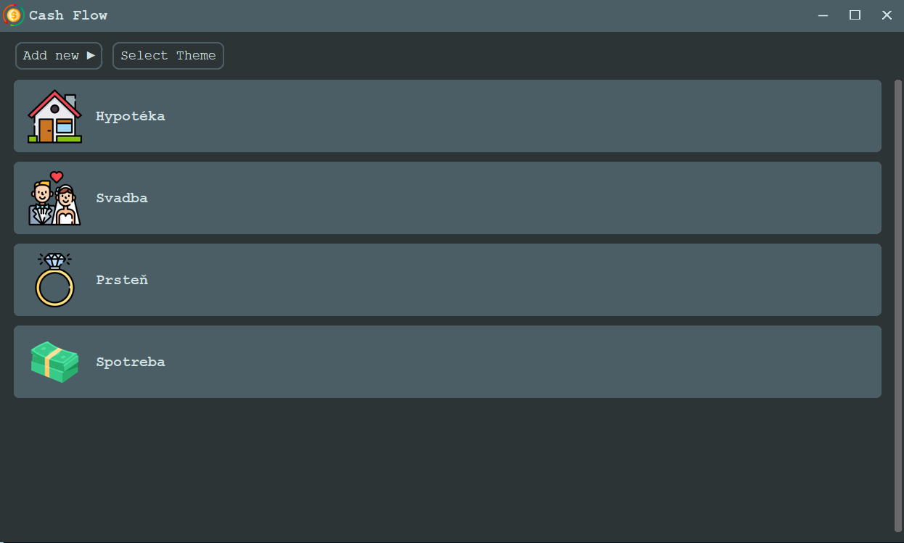
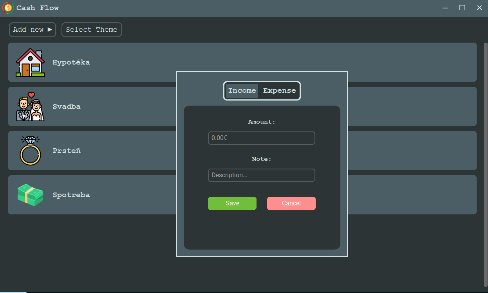
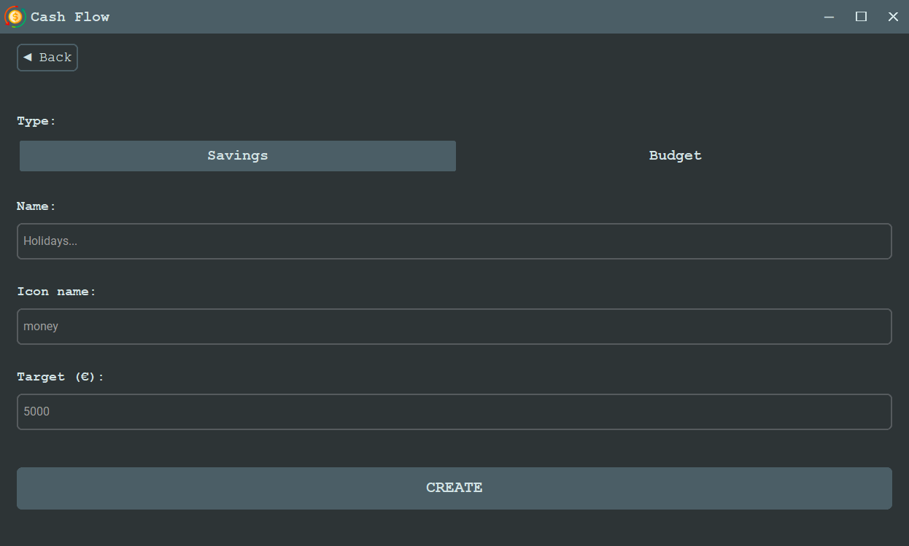
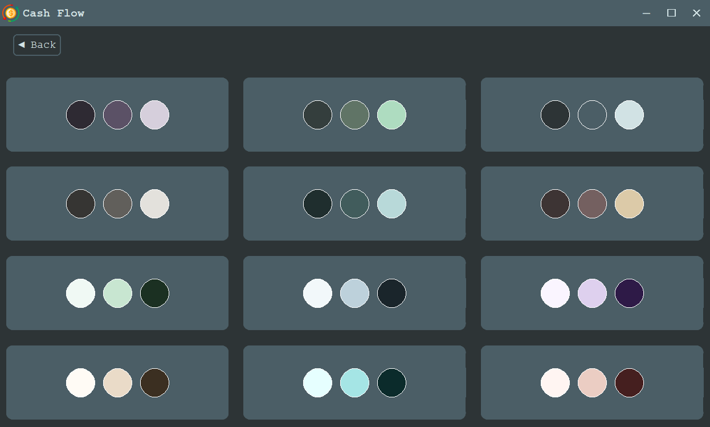
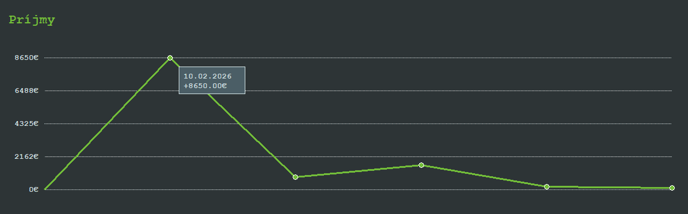
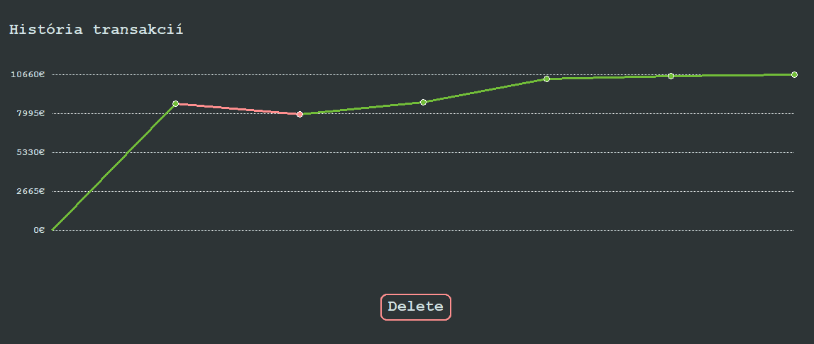

# Financial Tracking App

## 🎨 Personalization
Your workspace should feel like yours. My financial tracking app supports global theme customization, allowing you to wrap the entire interface in a color palette that suits your mood.

## 📊 Logic & Flow

| Action | Result | Purpose |
|--------|--------|---------|
| **Add new** | Define a budget or a savings goal. | Set up new budgets or savings categories. |
| **Right Click** | Transaction Modal | Fast-entry for money in/out. |
| **Left Click** | Full Report | Details about financial entity. |
| **Select Theme** | Color Picker | Update the color across the app. |

## 📷 Photos of the app

  
  

  
  

  
  

